sorry for the spealling mistakes i make 

day 1 the start 4/29/2026
time tracked - 1.30h

soooooooooooo firstly ts was honestly annoying bro omg i wanted to makea a macropad so i decided sure lemme make one how hard could it be i only used easyeda before and i dont feel like learning kicad so i just rolled with it i first had to see the qmk docs to know what i was dealing with then i choose a mcu i decided to go with the pico cus its easy yk lots of docs then i opened the docs for it went to the wiring diagram and hell began
i placed the chip in easyeda and i edited the footprint to make it look a lil nice easy to work with ik i am a dumbahh

so i started by adding all the capcitors linking them to gnd and honsetly idk what was i doing i kept looking between the docs and drc to figure out what to do i added caps to the ivodd pins all of em then i decided to add the usb c which gave me lotss of toruble dude i first started routing it with my skills learnt from the usb hub hehehehe i connected them to the usb of the pico i added a shield but when i saw it if elt it looekd ugly asf so i deleted everyting and tried making it look pretty but i felt like it wont work so i had to redo everything again painn and now the usb c is done i think here is the schamaatics so far 
looks so messy ik ik 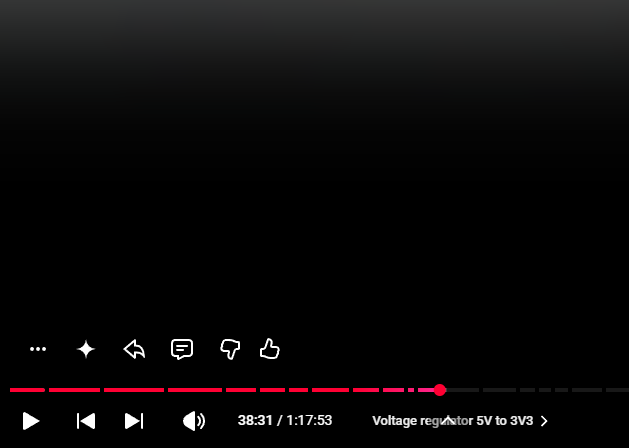

day 2 finsihed the mcu schematics 4/29/2026
time tracked - 1h

yippe i finished it i added alot of things firstly the 
voltage regulatour 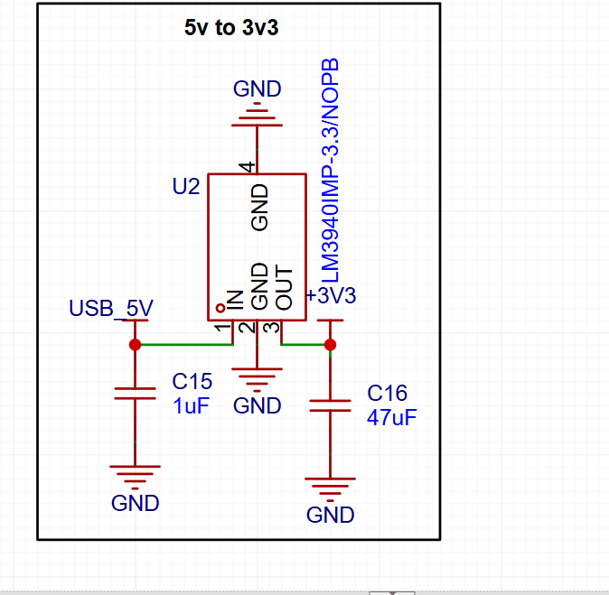

crystal
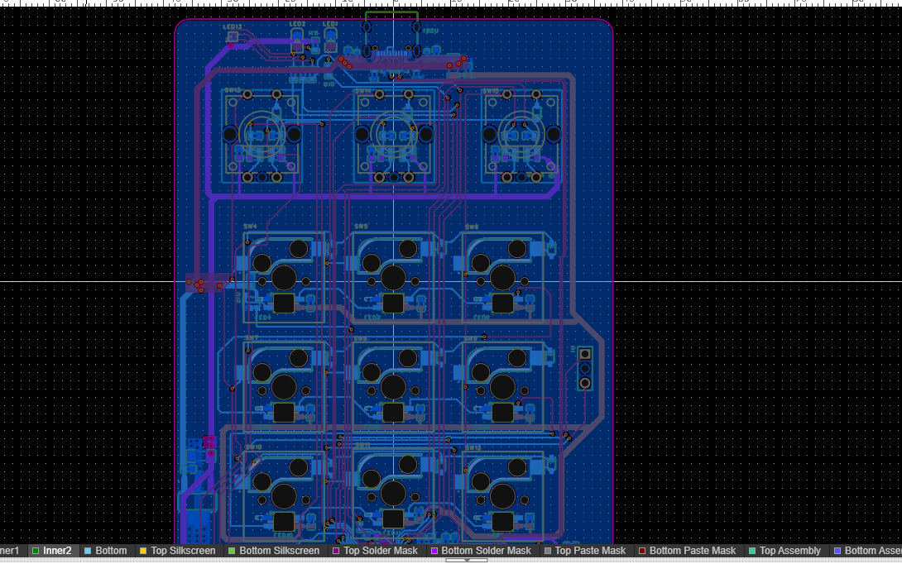

debug for debugging duh
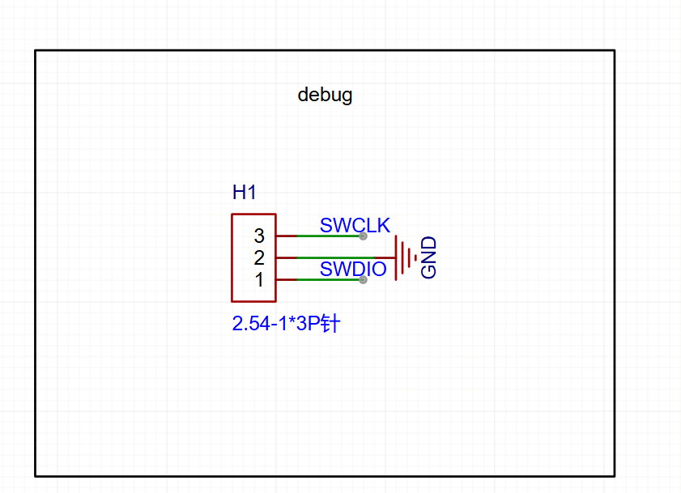

boot switch for switching duhh
 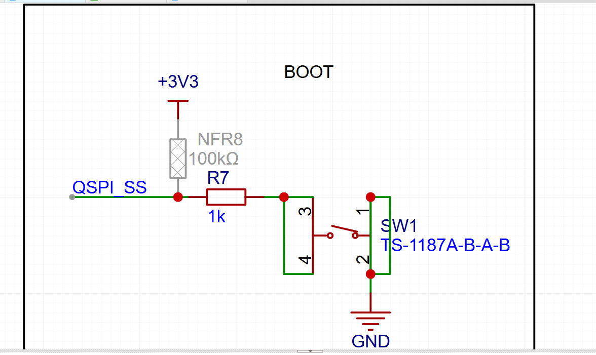

 reset button for reseting duhhh 
 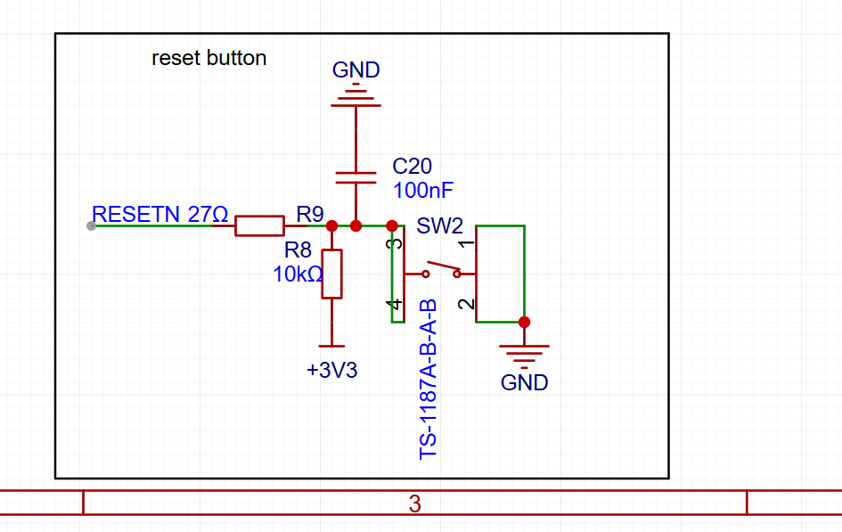

 flash for what say it with me for flashing duhhhhh
  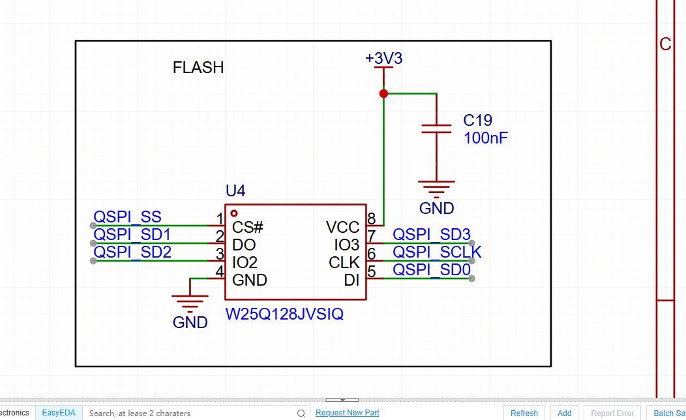

  then those lil baby cute leds 
  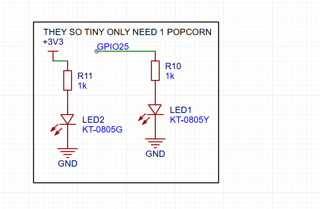

i just saw the docs kept following it not really much trouble and now were done yay 

day 3 started working on the switches 5/9/2026
time tracked - 1.3

okay so i decied to finally get back to this 
i first started by get a switch shaft then i edited the footprint cus it was lowk pmo and made it looks better i kinda failed

then i aslo go my switch and edited the footprint it still pmo so i edited the footprint much more
then i connected it to some capcitors and made the rows and coulmns then i connected it to the mcu and then i got a rotary encoder and did the same changed hte footprint and connected it 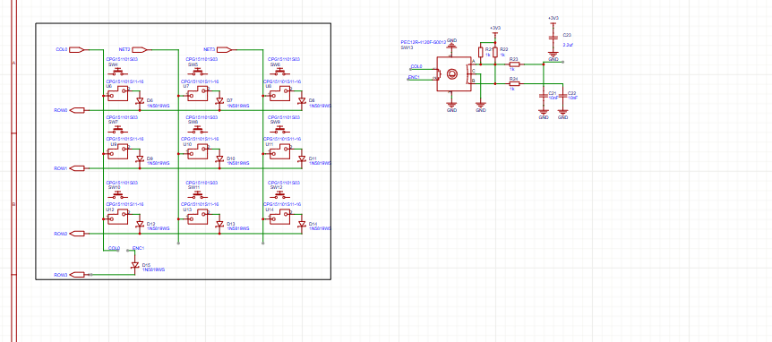

day 4 YAYAYAY I FINISHED THE SCHEMATICS 5/9/2026
time tracked - 1.3
what mostly i did was just add leds i finished the encoders and wired them up
i also finsihed the leds
i also added an rgb led for feedback so i started changing the footprint cus it was very ugly and me gag tbh but i made it look cool i am so awsome  and i finished wiring everyting putting it togther and here the finle schematics 
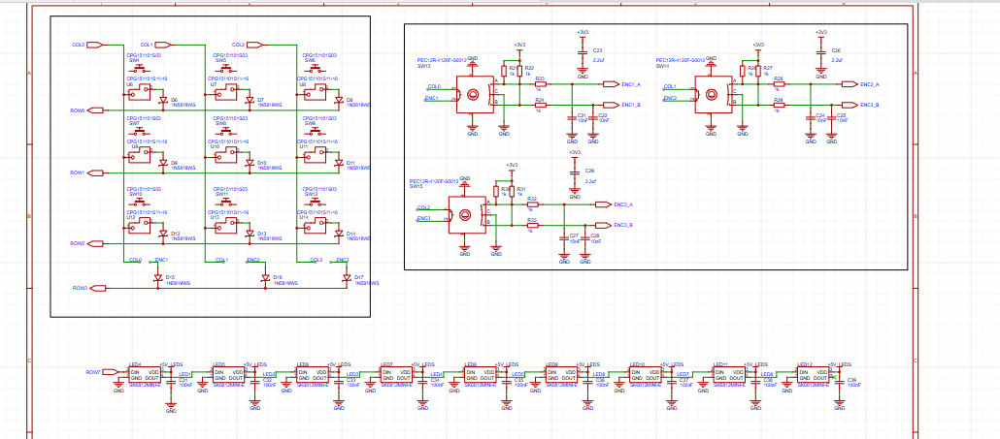
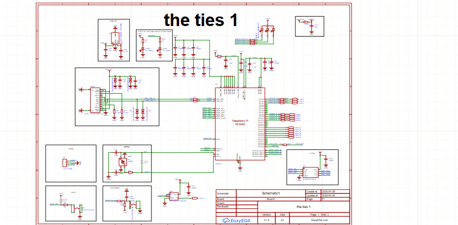

day 5 and 6
time tracked = 2h
hello there dear reviewer
sososoos i did alot of things well not alot kinda one but like kinda alot at the same time after i finished the schematics it was time for the great pcb so the first part was like 2 days ago and i was super sick and tired so i might not rember what i did but all i remember is me making the pcb outline adding the switches and the switch caps i think and there was a problem with the switch caps so i had to redo the footprint all over again and then i placed the board and wired the caps for it 
and part 2 is where i finsihed itnot alot happened just placing the parts going back and fourtgh i also made the schematics look a bit nicer and i noticed an issue with the switches that the 3d model was off so i had to re do all the switches but i finally got it and now its finished looks pretty 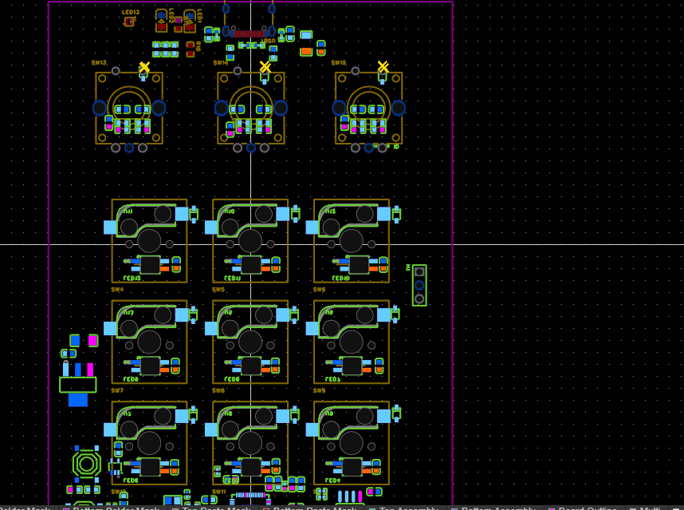

day 7
time tracked 2.6h 

started the pain of the routing so this is the hardest part routing so i had really really small place to work with 
but before routing i had to add some desgin rules so i did that changed everything and changed the vias to be easy and cheap for manifacturing and after i did that for some reason it said the lines r too thick so i had to redo all the desgin rules and restore them to deful but for also some unkown reason it stil said i cant untill i discoverd i need to change the width of the connection and re did all my desgin rules so after that i started the poor old routing which is not much but i had tooo little space so i was stuggling so much u dont even know but i manged then i had the worst thing possiable the flash pins there was so lill space so i just sat there for like what half an hour trying to wiggle it and crreating as much space as possiable for vias to go on the top layer and i finally did it so after that i went to connect the rows and cols of switches was pretty easy and then i got to routing the encoders i got pretty bored tbh so i just did 1 and said done for the day so prolly gonna contuine later 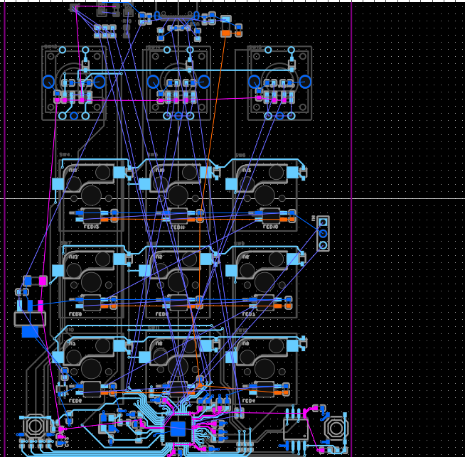
here is progress 

day 8
time tracked: 3:53h
 sorry for not journling as much i was pretty tired

holyy molly ok so i dont remember everything that happened cus it was multipale sessions  butt basically i think i started with the encoders and it was also very tricky cus i had to take them up from he bottom and then route them all the way up i am pretty tired cus its so annoying to like route and get all of these connections out of the way but we made it then i also connected the user led which was the hardest cus the pins were barruied deep under the led was up on the b oard so i had to do alot of go around untill i finally connected then i started with the usb DP connections and had to route themm all the way under and ofc i had to wiggle everything to make space for it ugh then seesion 2 where i think i started with the leds but at first i thought there was something weird but idk then after connecting all of them i relized idk where the buffer is so i went to change the buffer for the leds and then panic started i relized i had all the leds backwards so i had to re locate each switch and re route the pins,,, smh pain pain but i did it and i went to route the debug header and after that i added power for all the leds and routed them in rows so it can take power and i touted the power then i went to route the 5v usb yaya to the voltage regulator to get a 3v3 output to connect the encoders and speaking of encoders i discoverd my dumbahh had the caps flipped so i had to re flip them and re route them i have must been really tierd when i routed htem back then also i discoverd i had an issue with the encoder schematics so i edited that too and then i i i routed all the rest of the 3v3 power to the bottom and then the 1v1 which was verry annoying cus i bassicaly had 0 room but i finally made it and after that i routed all of the gnd pins rebuild hte inner layers and finally YAYAYAYAY WE FINISHED yippe finished all the routing every trace with my heart 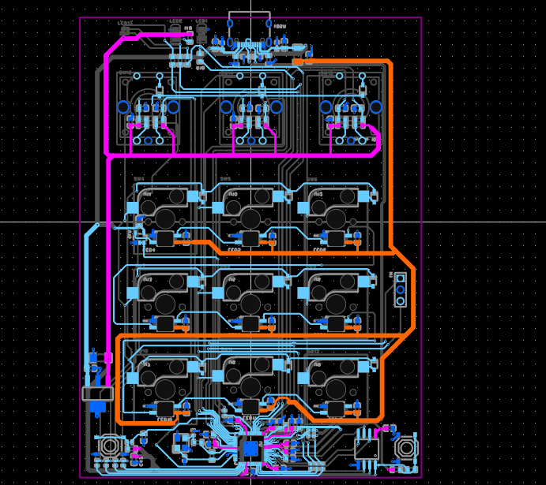 now bye dear reviewer 

day 9 
time tracked = 20 mins didint do much just filled some copper regions made it look betetr added alot of extra vias and its done
the pcb is done finally after 18 hrs of brutal brutal missery i did it i finished the pcb yuayayayayyaya im so happy okay now onto the the cad which is easy cus i love cad thx to construct

i am not done with it tho i am gonna improve the silk screen much more and gonna make it look cleaner just give me time cus i am tired of the easyeda menu

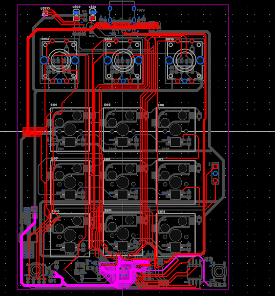